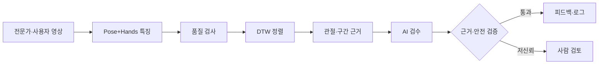

# AI Rehabilitation Motion Review

손목 부상 후 전문가 재활 영상을 따라 할 때, 동작이 실제로 얼마나 비슷한지 객관적으로 확인하기 위해 만든 개인 프로젝트입니다.

전문가 영상과 사용자 영상에서 **MediaPipe Pose + Hands** 특징을 추출하고, **DTW(Dynamic Time Warping)** 로 수행 속도의 차이를 정렬합니다. 이후 관절·구간별 편차를 근거 데이터로 만들고, AI가 그 근거 안에서만 교정 피드백을 생성하도록 검수합니다. 신뢰도가 낮거나 안전 확인이 필요한 결과는 자동 제공하지 않고 사람 검토 작업으로 분기합니다.

> 이 프로젝트는 의료 진단이나 치료를 제공하지 않는 동작 비교 프로토타입입니다.

## 무엇이 달라졌나

기존 프로젝트의 핵심 아이디어는 유지하면서 실행 경로를 다시 구성했습니다.

- 전문가/사용자 영상의 Pose+Hands 특징 추출
- DTW 누적 거리뿐 아니라 **실제 warping path** 복원
- 정렬 경로를 기준으로 관절·구간별 편차 산출
- 측정 근거를 벗어난 AI 피드백 차단
- AI 모델·프롬프트 버전·입출력·지연·fallback 기록
- 낮은 데이터 품질, 높은 통증 강도, 위험 표현의 검토 큐 분기
- 임의 난수가 아닌 SQL 기록 기반 운영 대시보드
- 원본 영상 미보관, 파생 특징만 선택적으로 저장
- 실제 영상 없이 전체 흐름을 확인하는 결정적 데모 모드

## 시스템 흐름



### 특징 벡터

현재 오른손 손목 신전 동작을 기준으로 다음 6개 특징을 사용합니다.

1. 오른쪽 팔꿈치 각도
2. 오른쪽 손목 신전 각도
3. 오른쪽 손바닥 벌림 각도
4. 오른쪽 손목 X 위치
5. 오른쪽 손목 Y 위치
6. 오른쪽 손 펼침 폭

각도와 좌표 단위가 DTW 비용을 왜곡하지 않도록 특징별 기준 차이로 정규화합니다.

## 빠른 실행

### 방법 A: Docker Compose

```bash
cp .env.example .env
docker compose up --build
```

- 웹 화면: <http://localhost:8080>
- API 문서: <http://localhost:8000/docs>
- n8n: <http://localhost:5678>

첫 실행은 `AI_REVIEW_MODE=demo`입니다. API 키가 없어도 모든 화면과 SQL 로그, 검토 큐를 확인할 수 있습니다.

### 방법 B: 데모만 로컬 실행

백엔드:

```bash
cd backend
python -m venv .venv
source .venv/bin/activate
pip install -r requirements.txt -r requirements-dev.txt
uvicorn app.main:app --reload
```

프런트:

```bash
cd frontend
npm install
npm run dev
```

실제 영상 분석까지 사용하려면 백엔드 환경에 아래 의존성을 추가합니다.

```bash
pip install -r requirements-vision.txt
```

## 데모 시나리오

1. 웹 화면에서 `데모 실행`을 선택합니다.
2. 통증 강도를 1~7로 두고 실행하면 DTW 분석과 `RETRY` 피드백을 확인할 수 있습니다.
3. 통증 강도를 8 이상으로 실행하면 결과가 `REVIEW`로 분기되고 SQL 검토 작업이 생성됩니다.
4. `검토·운영` 탭에서 검토 의견을 남겨 작업을 종료할 수 있습니다.
5. 대시보드의 분석 수, 유사도, 검토 대기 수가 실제 SQL 기록에 따라 변경됩니다.

데모는 `backend/app/services/demo_data.py`에서 생성하는 합성 포즈 특징을 사용합니다. 데이터 출처, 검수 제공자, 검증 상태에 모두 `demo`가 표시됩니다.

## 실제 영상 사용

### 1. 전문가 기준 등록

웹의 `전문가 기준 등록`에서 운동 ID, 버전, 설명과 영상을 입력합니다. 원본 영상은 임시 파일에서 처리한 뒤 삭제되고, 추출한 특징 시퀀스만 `reference_exercises`에 저장됩니다.

### 2. 사용자 영상 분석

`사용자 영상` 탭에서 전문가 기준과 비교할 영상을 올립니다. 오른손, 팔꿈치, 어깨가 함께 보이고 촬영 각도가 기준 영상과 유사해야 합니다.

### 3. AI 검수

분석 결과는 다음 형태로 AI에 전달됩니다.

```json
{
  "overall_similarity": 74.2,
  "data_quality": 0.91,
  "speed_ratio": 1.17,
  "worst_segments": [
    {
      "start_percent": 42,
      "end_percent": 47,
      "joint": "right_wrist_extension",
      "difference": 18.4,
      "unit": "deg"
    }
  ]
}
```

AI 교정 문장은 입력에 존재하는 관절과 수치를 근거에 포함해야 합니다. 근거가 맞지 않거나 JSON 스키마가 깨지면 결과를 폐기하고 결정적 정책 엔진으로 전환합니다.

## AI 검수 모드

### Demo

```env
AI_REVIEW_MODE=demo
```

- 외부 AI 호출 없음
- `demo-policy-engine`으로 명시
- 같은 입력에 같은 결과
- UI·SQL·검토 분기 재현 목적

### Claude live

```env
AI_REVIEW_MODE=live
ANTHROPIC_API_KEY=your_key
ANTHROPIC_MODEL=claude-sonnet-4-20250514
```

- Claude가 구조화된 검수 결과 생성
- Pydantic 스키마 검사
- 교정 문장과 측정 근거 일치 검사
- API·파싱·근거 검증 실패 시 정책 엔진 fallback
- 모든 제공자·모델·프롬프트 버전·입출력·fallback 여부 기록

## SQL 데이터 구조

| 테이블 | 역할 |
| --- | --- |
| `reference_exercises` | 전문가 기준 특징, 버전, 출처, 승인 여부 |
| `pose_attempts` | DTW 점수, 데이터 품질, 속도비, 취약 구간 |
| `ai_reviews` | AI 입출력, 근거 검증, 모델, latency, fallback |
| `review_tasks` | 사람 검토 사유, 처리 상태와 검토 의견 |

기본 로컬 데모는 SQLite를 사용하고 Docker Compose는 PostgreSQL을 사용합니다. SQLAlchemy 모델과 API는 동일합니다.

## n8n 검토 알림

`n8n/workflows/rehab-review-workflow.json`을 n8n에서 Import한 뒤 활성화하면 `/webhook/rehab-review`가 검토 이벤트를 받습니다. Slack이나 메일 노드를 연결하지 않아도 Webhook 수신, 검토 이벤트 정규화, 응답까지 재현할 수 있습니다.

실제 알림 채널을 연결하려면 n8n에서 `Build Review Event` 뒤에 조직의 메시징 노드를 추가합니다.

## 테스트

```bash
cd backend
pytest -q
```

검증 항목:

- 서로 다른 길이의 시퀀스가 DTW 경로로 정렬되는지
- 동일 시퀀스가 100점에 가까운지
- 데모 분석이 SQL 로그와 대시보드에 반영되는지
- 통증 강도 8 이상이 사람 검토 작업으로 분기되는지

프런트 빌드:

```bash
cd frontend
npm ci
npm run build
```

## API

| Method | Path | 설명 |
| --- | --- | --- |
| GET | `/health` | 서비스 상태와 검수 모드 |
| GET | `/api/references` | 전문가 기준 목록 |
| POST | `/api/references/import-video` | 전문가 영상 특징 등록 |
| POST | `/api/attempts/demo` | 결정적 데모 전체 실행 |
| POST | `/api/attempts/analyze` | 사용자 영상 분석·AI 검수 |
| GET | `/api/attempts/{id}` | 분석 및 검수 로그 |
| GET | `/api/review-tasks` | 사람 검토 작업 |
| PATCH | `/api/review-tasks/{id}` | 검토 처리 |
| GET | `/api/dashboard` | SQL 운영 지표 |

## 개인정보·안전 원칙

- 원본 사용자 영상은 서버에 영구 저장하지 않습니다.
- 기본 설정은 파생 특징만 저장합니다.
- 실제 운영에서는 사용자 식별정보와 분석 데이터를 별도 저장하고 접근통제를 적용해야 합니다.
- AI는 제공된 측정값을 설명할 뿐 진단하거나 치료를 처방하지 않습니다.
- 높은 통증 강도와 위험 표현은 자동 피드백보다 사람 확인을 우선합니다.
- 합성 데모와 전문가 승인 데이터는 UI와 DB에서 명확하게 구분합니다.

## 현재 한계

- 오른손 손목 신전 동작을 기준으로 설계했습니다.
- 단일 카메라 2D/준3D 랜드마크이므로 촬영 각도와 가림에 영향을 받습니다.
- 데모 기준은 전문가 승인 데이터가 아닙니다.
- 실제 임상 효용이나 치료 효과를 검증하지 않았습니다.
- 운동별로 적절한 특징, 기준값, 촬영 지침을 별도로 검증해야 합니다.

이 한계를 숨기지 않고 데이터 출처, 승인 상태, 품질, 검수 이력을 시스템에 함께 기록합니다.

