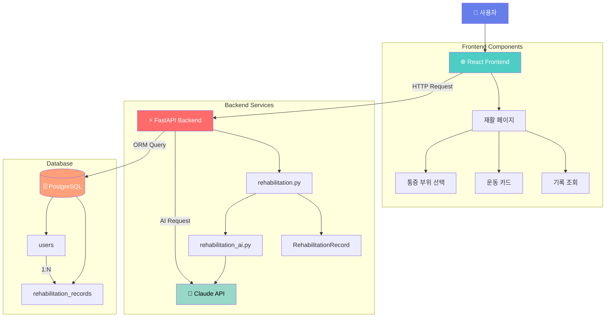
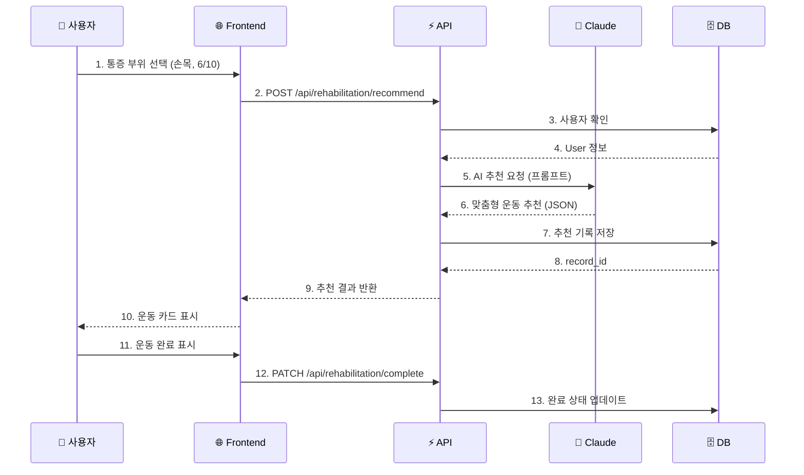
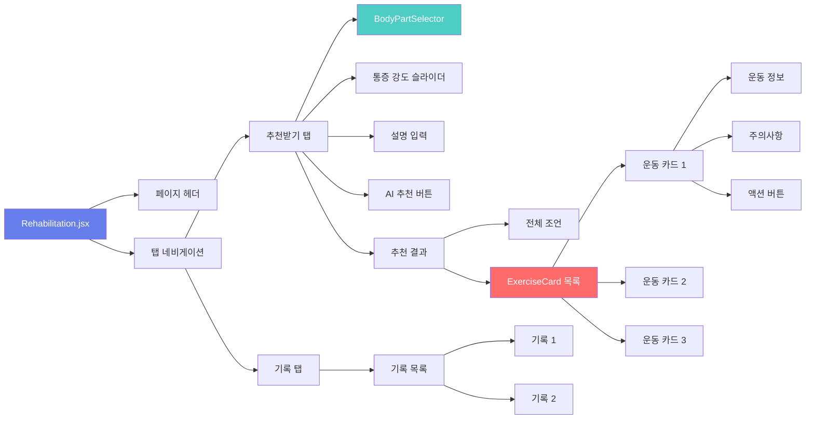
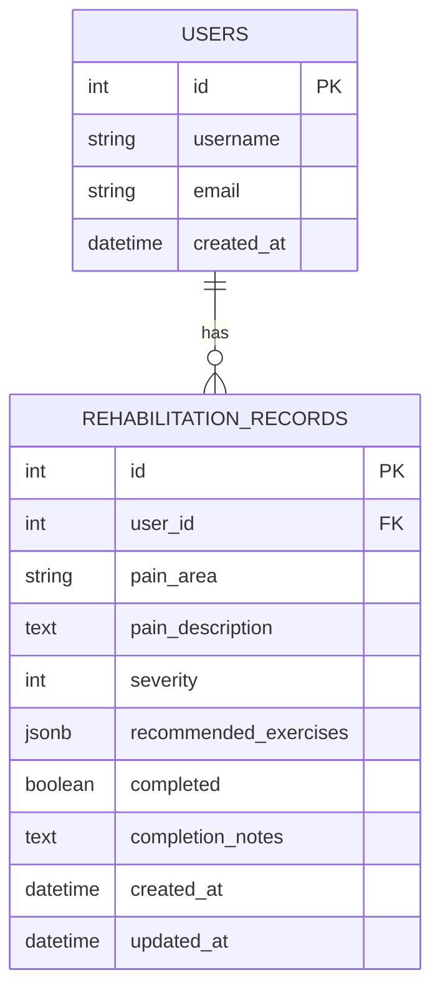
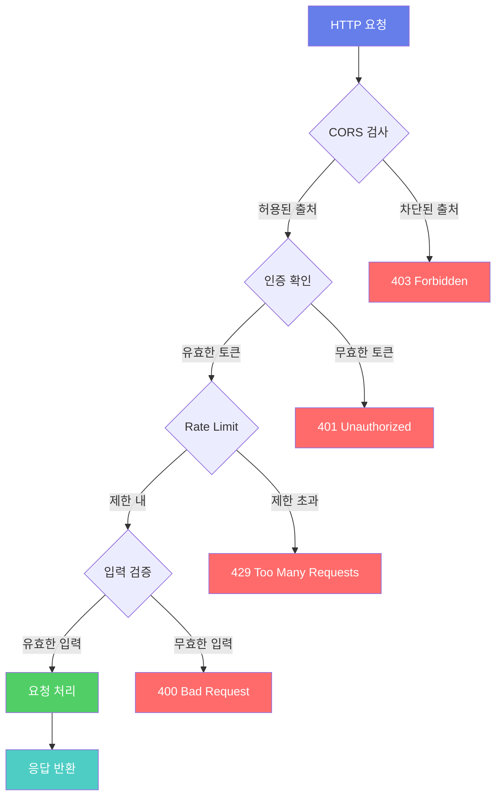
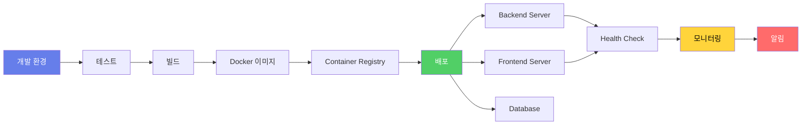

# 🏥 AI 재활 운동 추천 시스템 아키텍처

## 📊 전체 시스템 구조



## 🔄 데이터 흐름



## 🎨 UI 컴포넌트 구조



## 🗄️ 데이터베이스 스키마



## 📡 API 엔드포인트 맵

```mermaid
graph LR
    API[/api/rehabilitation] --> Recommend[POST /recommend]
    API --> History[GET /history/:id]
    API --> Complete[PATCH /complete/:id]
    API --> Stats[GET /statistics/:id]
    API --> Delete[DELETE /record/:id]
    
    Recommend --> |Request| ReqBody1[통증 정보]
    Recommend --> |Response| ResBody1[AI 추천]
    
    History --> |Response| ResBody2[기록 목록]
    
    Complete --> |Request| ReqBody2[완료 정보]
    Complete --> |Response| ResBody3[업데이트 결과]
    
    Stats --> |Response| ResBody4[통계 데이터]
    
    style API fill:#667eea,color:#fff
    style Recommend fill:#51cf66,color:#fff
    style History fill:#4ECDC4,color:#fff
    style Complete fill:#ffd43b,color:#000
    style Stats fill:#FF6B6B,color:#fff
```

## 🔐 보안 흐름



## 🚀 배포 파이프라인



---

## 📝 주요 기술 스택 요약

| 계층 | 기술 | 역할 |
|------|------|------|
| **Frontend** | React + Vite | UI 렌더링 |
| **API** | FastAPI | REST API 서버 |
| **AI** | Claude API | 운동 추천 생성 |
| **Database** | PostgreSQL | 데이터 저장 |
| **ORM** | SQLAlchemy | DB 추상화 |
| **Migration** | Alembic | 스키마 관리 |
| **Styling** | CSS3 | UI 디자인 |

---

## 🎯 핵심 기능 흐름

### 1️⃣ AI 추천 받기
```
사용자 입력 → Frontend 검증 → API 호출 → Claude AI 요청 
→ 추천 생성 → DB 저장 → 결과 반환 → UI 표시
```

### 2️⃣ 운동 완료하기
```
완료 버튼 클릭 → API 호출 → DB 업데이트 
→ 통계 갱신 → 성공 메시지
```

### 3️⃣ 기록 조회하기
```
기록 탭 클릭 → API 호출 → DB 쿼리 
→ 데이터 반환 → 목록 렌더링
```

---

**Made with 💙 using Mermaid.js**
